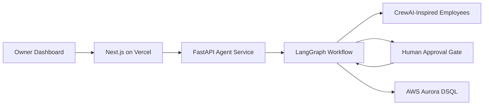

# Architecture

The Agentic Virtual Property Manager uses CrewAI and LangGraph for different jobs.

CrewAI defines the specialist employees:

- Orchestrator Manager
- Leasing Agent
- Maintenance Agent
- Finance Agent
- Compliance Agent

LangGraph coordinates the work:

- Routes each task to the correct specialist.
- Stores task state.
- Writes audit logs at each node transition.
- Pauses for human approval on risky actions.
- Resumes after approval or rejection.

The backend API exposes dashboard-ready data. The frontend does not know graph internals; it only knows properties, task runs, task logs, and approval decisions.

## Persistence

Production uses Aurora DSQL through the PostgreSQL-compatible repository in `services/agent/app/store/postgres.py`. The backend chooses that repository when `DATABASE_URL`, `AURORA_DSQL_DATABASE_URL`, or `AURORA_DSQL_ENDPOINT` exists.

Local development falls back to SQLite for portability. The repository interface keeps persistence behind `services/agent/app/store`, so task runs, approvals, and audit logs can move between SQLite and Aurora DSQL without changing the API or dashboard contract.
